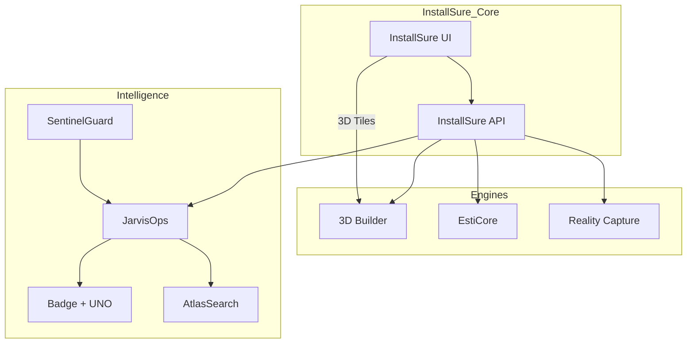
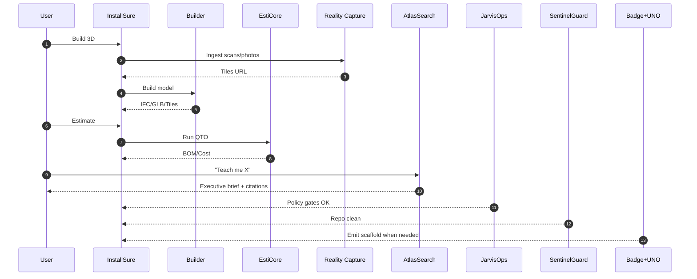

```mermaid
flowchart TB
  subgraph InstallSure_Core
    IS_UI[InstallSure UI]
    IS_API[InstallSure API]
  end

  subgraph Engines
    BLD[3D Builder]
    EST[EstiCore]
    RC[Reality Capture]
  end

  subgraph Intelligence
    JAR[JarvisOps]
    BADGE[Badge + UNO]
    ATLAS[AtlasSearch]
    SENT[SentinelGuard]
  end

  IS_UI --> IS_API
  IS_API --> BLD
  IS_API --> EST
  IS_API --> RC

  IS_API --> JAR
  JAR --> ATLAS
  JAR --> BADGE
  SENT --> JAR

  IS_UI -->|3D Tiles| BLD
```

```mermaid
sequenceDiagram
  autonumber
  participant U as User
  participant IS as InstallSure
  participant B as Builder
  participant E as EstiCore
  participant R as Reality Capture
  participant A as AtlasSearch
  participant J as JarvisOps
  participant G as SentinelGuard
  participant X as Badge+UNO

  U->>IS: Build 3D
  IS->>R: Ingest scans/photos
  R-->>IS: Tiles URL
  IS->>B: Build model
  B-->>IS: IFC/GLB/Tiles
  U->>IS: Estimate
  IS->>E: Run QTO
  E-->>IS: BOM/Cost
  U->>A: "Teach me X"
  A-->>U: Executive brief + citations
  J-->>IS: Policy gates OK
  G-->>IS: Repo clean
  X-->>IS: Emit scaffold when needed
```